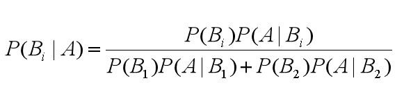
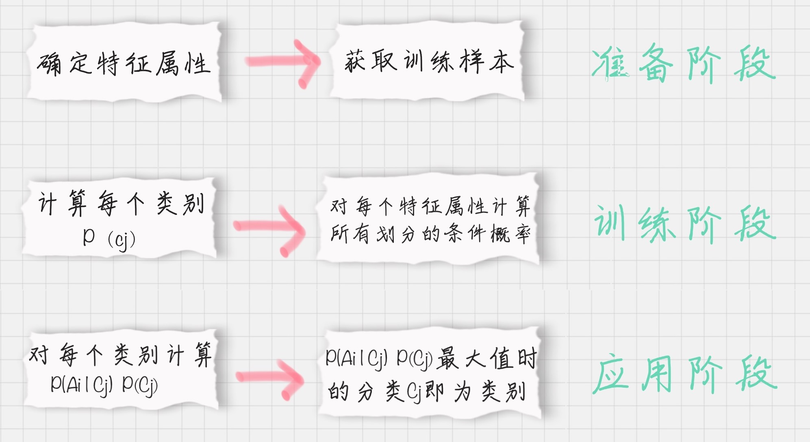

# text_classification
中文文档分类数据集
配套陈旸老师的《人人都听得懂的清华大学数据挖掘》里的练习
数据说明：

1、文档共有4中类型：女性、体育、文学、校园

2、训练集放到train文件夹里，测试集放到test文件夹里。停用词放到stop文件夹里。

请使用**朴素贝叶斯分类**对训练集进行训练，并对测试集进行验证，并给出测试集的准确率。

## 什么是 TF-IDF 值呢？

TF-IDF 是一个统计方法，用来评估某个词语对于一个文件集或文档库中的其中一份文件的重要程度。 TF-IDF 实际上是词频 TF 和逆向文档频率 IDF 的乘积。

## 先验概率
通过经验来判断事情发生的概率
## 后验概率
后验概率就是发生结果之后，推测原因的概率
## 条件概率
事件 A 在另外一个事件 B 已经发生条件下的发生概率，表示为 P(A|B)，读作“在 B 发生的条件下 A 发生的概率”

## 贝叶斯定理
提出如何求解“逆向概率“

## **贝叶斯公式**

## 朴素贝叶斯分类器工作流程

## [sklearn: TfidfVectorizer 中文处理及一些使用参数](https://blog.csdn.net/blmoistawinde/article/details/80816179)

'''
    tfidf_model2 = TfidfVectorizer(token_pattern=r"(?u)\b\w+\b").fit(document)
    print(tfidf_model2.vocabulary_)
    # {'我': 8, '是': 12, '一条': 1, '天狗': 7, '呀': 6, '把': 9, '月': 13, '来': 14, '吞': 5, '了': 2, '日来': 10, '一切': 0, '的': 15, '星球': 11, '全宇宙': 4, '便是': 3}

'''
